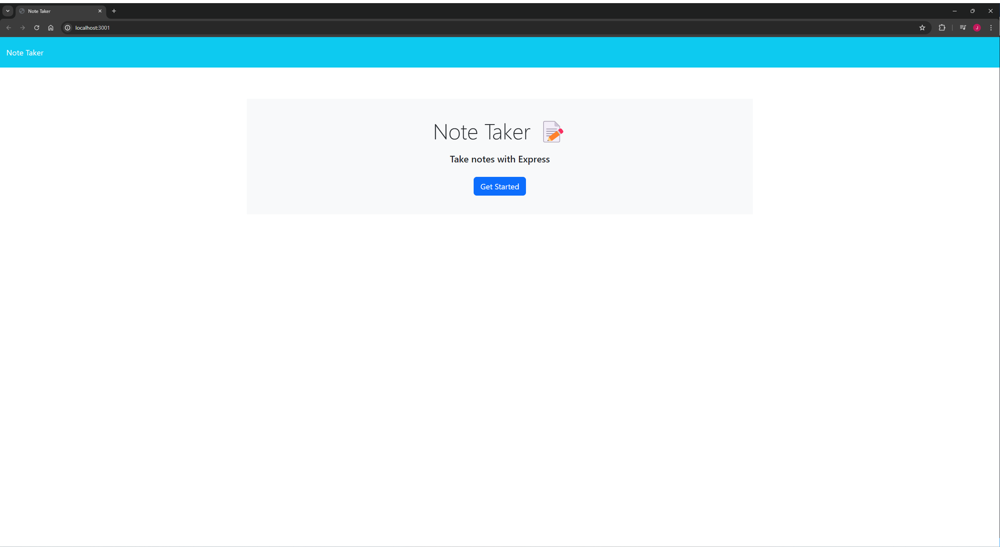
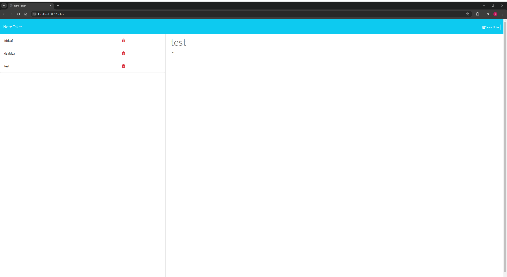
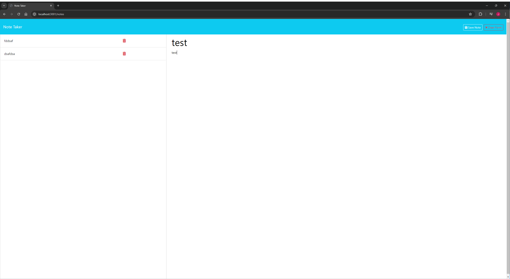

# Note Taker

This site was created for my Module 11 Challenge assignment for the UNCC FullStack coding bootcamp. It is a site that allows the user to write a title and body content for notes, and save them to a json file. They are then able to view the notes they have saved and create new ones. This site was created in accordance to the following User Story and Acceptance Criteria.

## User Story

```
AS A small business owner
I WANT to be able to write and save notes
SO THAT I can organize my thoughts and keep track of tasks I need to complete
```

## Acceptance Criteria

```
GIVEN a note-taking application
WHEN I open the Note Taker
THEN I am presented with a landing page with a link to a notes page
WHEN I click on the link to the notes page
THEN I am presented with a page with existing notes listed in the left-hand column, plus empty fields to enter a new note title and the note’s text in the right-hand column
WHEN I enter a new note title and the note’s text
THEN a "Save Note" button and a "Clear Form" button appear in the navigation at the top of the page
WHEN I click on the Save button
THEN the new note I have entered is saved and appears in the left-hand column with the other existing notes and the buttons in the navigation disappear
WHEN I click on an existing note in the list in the left-hand column
THEN that note appears in the right-hand column and a "New Note" button appears in the navigation
WHEN I click on the "New Note" button in the navigation at the top of the page
THEN I am presented with empty fields to enter a new note title and the note’s text in the right-hand column and the button disappears
```

## How to Use

Once you open the site and see the home page click on the 'Get Started' button. Then you will be redirected to a page containing your previous notes displayed on the left, and an area to type a new note in the center of the screen. Once you have entered your new note title and start entering the contents of the note, a 'Save Note' and a 'Clear Form' buttons will appear on the top right of the navbar. Click 'Save Note' to save your note to the left side of the screen once you have finished filling it out. If you are not happy with the note you have written and want to start over, click the 'Clear Form' button. To view a previously written note, click on the title of the note on the left side of the screen.

## Screenshots







## Links

https://github.com/jregues/note-taker
